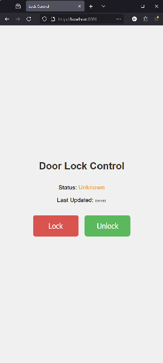

# YKK AP スマートロックブリッジ for Home Assistant

[](LICENSE)
[]()
[]()

[**Click here for English README (英語版はこちら)**](README.md)

---

このAndroidアプリケーションは、YKK APのスマートロックをMQTTやローカルWebサーバー経由でHome Assistantと連携させるためのブリッジとして機能します。

このプロジェクトは、YKK APの電気錠「スマートコントロールキー」をスマートホームで利用するための堅牢なソリューションを提供します。公式にAPIが公開されていないこの製品を、Androidの「ユーザー補助サービス」を利用してプログラム的に操作し、ドアの施錠・解錠、状態の読み取りを可能にします。

  

## 主な機能

-   **Home Assistant連携**: 信頼性の高いMQTT接続を通じて、状態の監視と完全なコントロールを実現します。
-   **高機能なWeb UI**: ローカルネットワーク上のどのブラウザからでもアクセス可能な、動的なWebインターフェース。リアルタイムで状態（最終更新時刻付き）を確認し、施錠・解錠操作ができます。
-   **JSON APIエンドポイント**: `/status` エンドポイントを通じて、現在のロック状態と最終更新時刻をJSON形式で取得可能。独自のカスタム連携に利用できます。
-   **リアルタイムな状態通知**: ロックの状態 (`LOCKED`, `UNLOCKED`, `UNAVAILABLE`) の変化を即座にHome Assistantへ発行します。
-   **安定性と信頼性**:
    -   OSによる強制終了を防ぐため、フォアグラウンドサービスとして常時実行されます。
    -   YKK AP公式アプリが無応答になった場合を想定し、インテリジェントなリトライ処理を実装。
    -   MQTTの遺言（Last Will and Testament）機能により、接続が切れた際にHome Assistant上で正しく `offline` と表示させます。
    -   UI操作を確実に行うため、必要に応じて自動でデバイスの画面を点灯させます。
-   **root化不要**: 標準的な、root化されていないAndroidデバイスで動作します。
-   **モダンなUI**: Jetpack Composeで構築されたクリーンなUIで、MQTTやWebサーバーの設定を簡単に行えます。

## システム構成

このアプリは、錠の近くに設置した専用のAndroidデバイスにインストールして使用します。バックグラウンドでサービスが動作し、各種コマンドを待機しながらYKK AP公式アプリを操作します。

#### Home Assistant連携フロー

Home Assistantからのコマンドが物理的な錠に伝わるまでの流れです。


#### Web UI単体利用フロー

MQTTやHome Assistantなどの外部システムに依存せず、内蔵のWeb UIのみで錠を操作する場合の流れです。


## 必要なもの

1.  **専用のAndroidデバイス**: Android 8.0 (API 26) 以降を搭載し、常時電源に接続してドアの近くに設置できるスマートフォンまたはタブレット。
2.  **YKK AP公式アプリ**: 専用デバイスにGoogle Playストアから[「スマートコントロールキー」アプリ](https://play.google.com/store/apps/details?id=com.alpha.lockapp)をインストールし、ご自宅のドアとのペアリングを完了させてください。
3.  **Home AssistantとMQTTブローカー** (任意): Home Assistantと連携する場合にのみ必要です。

## インストールと設定

### ステップ1: Androidデバイスの準備

1.  **YKK AP公式アプリのインストール**: 専用のAndroidデバイスに「スマートコントロールキー」アプリをインストールし、ドアとのペアリングを済ませます。
2.  **本アプリのインストール**: このリポジトリの[Releasesページ](https://github.com/your-username/your-repo/releases)から最新の`.apk`ファイルをダウンロードし、同じAndroidデバイスにインストールします。
3.  **ロック画面の無効化**: 信頼性を最大限に高めるため、Androidデバイスの画面ロックを「なし」または「スワイプ」に設定することを強く推奨します。本アプリは非セキュアなロック画面を解除する機能を持ちますが、無効化することで潜在的な失敗要因を排除できます。

### ステップ2: アプリの設定

1.  **アプリの起動**: 「YKK AP Smart Lock Assistant」アプリを開きます。
2.  **権限の許可**: メイン画面の案内に従い、サービスの実行に不可欠な3つの権限を許可します。
    *   **ユーザー補助サービス**: この連携の核となる権限です。YKK APアプリの画面から錠の状態を読み取り、施錠・解錠ボタンをタップするために使用します。
    *   **通知**: バックグラウンドでの安定動作に不可欠な、フォアグラウンドサービスとして実行するために必要です。
    *   **バッテリー最適化の除外**: Android OSが省電力のためにアプリをスリープさせることを防ぎます。
3.  **連携機能の設定**:
    *   画面右上のアイコンから**Settings**（設定）に移動します。
    *   使用したい機能を選択します（片方のみ、または両方の有効化が可能）。
    *   **Web Server**: ブラウザ経由での操作を有効にします。ポート番号は変更可能です。
    *   **Home Assistant via MQTT**: Home Assistant連携を有効にし、MQTTブローカーのURL、ポート、認証情報（必要な場合）を入力します。
    *   **Save**（保存）をタップします。
4.  **サービスの開始**: メイン画面に戻り、**"Start Service"**をタップします。有効にした機能のステータス表示が更新されるはずです。

### ステップ3: Home Assistantの設定 (任意)

MQTT連携を有効にした場合、Home Assistantの`configuration.yaml`に以下の設定を追加してください。

```yaml
# スマートドアロックのためのMQTT連携設定
mqtt:
  lock:
    - name: "Smart Door Lock"
      unique_id: smart_door_lock_mqtt
      state_topic: "home/doorlock/state"
      command_topic: "home/doorlock/set"
      payload_lock: "LOCK"
      payload_unlock: "UNLOCK"
      state_locked: "LOCKED"
      state_unlocked: "UNLOCKED"
      optimistic: false
      qos: 1
      retain: false
      availability:
        - topic: "home/doorlock/availability"
      payload_available: "online"
      payload_not_available: "offline"
      device:
        identifiers:
          - smart_door_lock_mqtt
        name: "Smart Door Lock"
        manufacturer: "YKK AP"
        model: "Smart Control Key Bridge"

  button:
    - name: "Update Door Lock Status"
      unique_id: smart_door_lock_update_status
      command_topic: "home/doorlock/check_status"
      payload_press: "CHECK"
      retain: false
      device:
        identifiers:
          - smart_door_lock_mqtt

  sensor:
    - name: "Door Lock Last Update"
      unique_id: smart_door_lock_last_update
      state_topic: "home/doorlock/last_updated"
      device_class: timestamp
      device:
        identifiers:
          - smart_door_lock_mqtt

    - name: "Door Lock Status"
      unique_id: smart_door_lock_status
      state_topic: "home/doorlock/state"
      device:
        identifiers:
          - smart_door_lock_mqtt
      availability:
        - topic: "home/doorlock/availability"
      payload_available: "online"
      payload_not_available: "offline"
      icon: >-
        
          mdi:lock
        
          mdi:lock-open
        
          mdi:lock-question
        
```

YAMLを追加した後、Home AssistantのMQTT連携をリロードすると、新しいデバイスとエンティティが利用可能になります。

## Web UIでの単体利用

Home Assistantを使用しない場合でも、内蔵のWeb UIを使って錠を操作できます。アプリの設定で「Web Server」を有効にし、「Home Assistant via MQTT」を無効のままにしてください。

**URL**: `http://<AndroidデバイスのIPアドレス>:<ポート番号>`

このインターフェースでは以下の機能が提供されます:
-   施錠・解錠ボタンによる直接操作。
-   リアルタイムの**状態**表示（`LOCKED`, `UNLOCKED`, `UNKNOWN`）。数秒ごとに自動更新されます。
-   **最終更新**時刻の表示。状態を最後に取得してからの経過時間がリアルタイムでカウントアップします。

<details>
<summary><strong>► Web UIへインターネット経由で安全にアクセスする方法</strong></summary>

ルーターのポートフォワーディング（ポート開放）機能を使ってサービスをインターネットに直接公開することは、重大なセキュリティリスクを伴うため**強く非推奨**です。より安全な方法として、[Tailscale](https://tailscale.com)や[NetBird](https://netbird.io)のようなゼロコンフィグVPNサービスの利用が挙げられます。

ここではTailscaleを例に説明します。Tailscaleは、お使いのデバイス間に安全なプライベートネットワークを構築し、ポートを開放することなく、まるでローカルネットワーク内にいるかのようにブリッジアプリのWebサーバーにアクセスできるようにします。

1.  **Tailscaleアカウントの作成**: [Tailscaleのウェブサイト](https://login.tailscale.com/start)で無料の個人アカウントを作成します。

2.  **ブリッジ用AndroidデバイスへのTailscaleのインストール**:
    *   ブリッジアプリを実行している専用のAndroidデバイスでGoogle Playストアを開きます。
    *   [Tailscaleアプリ](https://play.google.com/store/apps/details?id=com.tailscale.ipn)を検索してインストールします。
    *   Tailscaleアプリを開き、作成したアカウントでログインします。
    *   プロンプトが表示されたらVPN接続を有効にします。

3.  **クライアントデバイスへのTailscaleのインストール**:
    *   錠を操作したいデバイス（普段お使いのスマートフォンやPCなど）にもTailscaleアプリをインストールします。ダウンロードリンクは[Tailscaleのダウンロードページ](https://tailscale.com/download)にあります。
    *   **同じ**Tailscaleアカウントでログインします。

4.  **ブリッジデバイスのTailscale IPアドレスの確認**:
    *   クライアントデバイスでTailscaleアプリを開くと、あなたのプライベートネットワーク（"tailnet"）内の全デバイスのリストが表示されます。
    *   リストからブリッジ用のAndroidデバイスを見つけ、そのIPアドレスをメモします。通常は`100.x.x.x`で始まります。

5.  **Web UIへの接続**:
    *   クライアントデバイスでWebブラウザを開きます。
    *   アドレスバーに `http://<TAILSCALEのIPアドレス>:<ポート番号>` と入力します。`<TAILSCALEのIPアドレス>`は先ほどメモしたIPアドレスに、`<ポート番号>`はブリッジアプリで設定したポート番号（例: `8080`）に置き換えてください。

これで、世界中のどこからでも安全に錠を操作できます。Tailscaleのより詳しい使い方については、公式ドキュメントの[tailnet内のデバイスへの接続方法](https://tailscale.com/kb/1452/connect-to-devices)（英語）を参照してください。

</details>

## トラブルシューティング

-   **サービスがランダムに停止する**: ほとんどの場合、スマートフォンメーカー（Samsung, OnePlus, Xiaomiなど）による過度なバッテリー最適化が原因です。「バッテリー最適化の除外」を許可していることを確認し、それ以外にもメーカー独自の省電力設定やアプリがないか確認してください。
-   **「制限付き設定」のポップアップが表示される**: 新しいバージョンのAndroidでは、サイドロードしたアプリ（Playストア以外からインストールしたアプリ）に対してユーザー補助サービスを有効にする際に保護機能が働きます。アプリ内に表示される案内に従い、一度システムのアプリ情報画面に移動し、「制限付き設定を許可」することで、サービスを有効にできるようになります。
-   **錠の状態が「UNAVAILABLE」になる**: ユーザー補助サービスがYKK APアプリの状態を読み取れないことを意味します。考えられる原因は以下の通りです。
    -   YKK APアプリが接続エラーを表示している。
    -   スマートフォンの画面は点灯しているが、YKK APアプリがフォアグラウンド（最前面）にない。
    -   YKK APアプリがアップデートされ、UIが変更されたことで本アプリが対応できなくなった。
    -   Home Assistantの「Update Door Lock Status」ボタンを押すか、本アプリのメイン画面でステータスを更新し、再チェックを試みてください。

## コントリビュート

改善のアイデアやバグの発見など、あらゆるコントリビュートを歓迎します！お気軽にIssueを立てるか、プルリクエストを送ってください。

## ライセンス

このプロジェクトはGPT3ライセンスの下で公開されています。詳細は[LICENSE](LICENSE)ファイルを参照してください。
