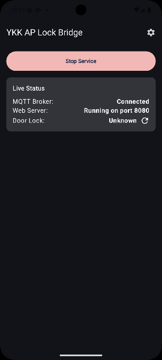
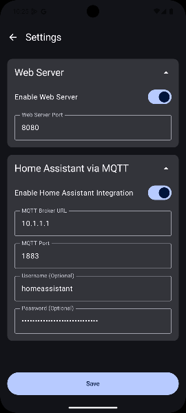
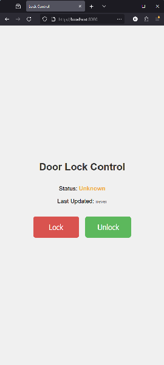
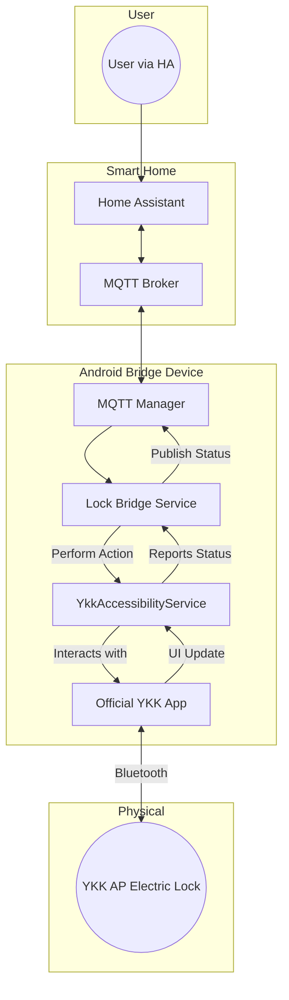
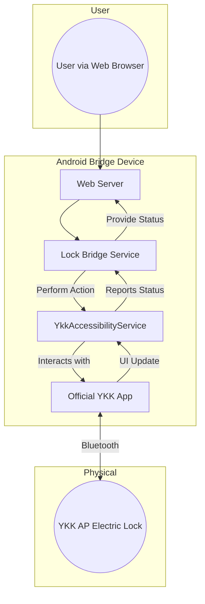

# YKK AP Smart Lock Bridge for Home Assistant

[](LICENSE)
[]()
[]()

An Android application that acts as a bridge, integrating your YKK AP smart lock with Home Assistant via MQTT and a local web server.

This project provides a robust solution for controlling and monitoring your YKK AP "スマートコントロールキー" (Smart Control Key) electric lock, which lacks a public API for smart home integration. By leveraging Android's Accessibility Service, this app can programmatically interact with the official YKK AP application to lock, unlock, and read the status of your door.

  

## Features

-   **Home Assistant Integration**: Full control and status monitoring through a highly reliable MQTT connection.
-   **Rich Web UI**: A dynamic, local web interface for locking/unlocking, viewing the live lock status, and seeing a "last updated" relative timestamp that updates in real-time. Accessible from any browser on your network.
-   **JSON API Endpoint**: Includes a simple `/status` endpoint that returns the current lock state and last update timestamp in JSON format for custom integrations.
-   **Real-time Status**: Publishes lock status (`LOCKED`, `UNLOCKED`, `UNAVAILABLE`) instantly to Home Assistant.
-   **Robust and Reliable**:
    -   Runs as a persistent foreground service to prevent the OS from terminating it.
    -   Includes intelligent retry logic for operations to handle unresponsiveness from the official YKK app.
    -   Uses MQTT's Last Will and Testament (LWT) to correctly report the lock as `offline` in Home Assistant if the connection is lost.
    -   Automatically wakes the device screen to ensure UI interactions are successful.
-   **No Root Required**: Operates on a standard, non-rooted Android device.
-   **Modern UI**: A clean, Jetpack Compose-based user interface for easy configuration of MQTT and web server settings.

## System Architecture

The application offers two primary modes of operation: a full integration with Home Assistant via MQTT, or a standalone mode using the local Web UI.

#### Home Assistant Integration Flow

This diagram shows how commands flow from Home Assistant to the physical lock.



#### Standalone Web UI Flow

This diagram shows how the self-contained Web UI controls the lock without any external dependencies like MQTT or Home Assistant.



## Prerequisites

1.  **Dedicated Android Device**: An Android phone or tablet (Android 8.0 Oreo / API 26 or newer) that can be left powered on and close to the door lock at all times.
2.  **YKK AP App**: The official [スマートコントロールキー app](https://play.google.com/store/apps/details?id=com.alpha.lockapp) installed and paired with your door lock on the dedicated Android device.
3.  **Home Assistant & MQTT Broker** (Optional): Required only if you want to integrate with Home Assistant.

## Installation and Configuration

### Step 1: Android Device Setup

1.  **Install the YKK AP App**: Install the "スマートコントロールキー" app from the Google Play Store on your dedicated Android device and complete the pairing process with your door lock.
2.  **Install This App**: Download the latest `.apk` from the [Releases page](https://github.com/your-username/your-repo/releases) of this repository and install it on the same Android device.
3.  **Disable Lock Screen**: For maximum reliability, it is recommended to disable the screen lock (set to "None" or "Swipe") on the Android device. The app is designed to dismiss non-secure lock screens, but disabling it entirely removes a potential point of failure.

### Step 2: App Configuration

1.  **Launch the App**: Open the "YKK AP Smart Lock Assistant" app.
2.  **Grant Permissions**: The main screen will guide you through granting three critical permissions required for the service to run:
    *   **Accessibility Service**: This is the core of the integration. It allows the app to read the lock status from the YKK app's screen and click the lock/unlock buttons.
    *   **Notifications**: Required for the app to run as a persistent foreground service, which is essential for background operation.
    *   **Battery Optimization Exemption**: Prevents the Android OS from putting the app to sleep to save power.
3.  **Configure Integrations**:
    *   Navigate to **Settings** (top-right icon).
    *   Decide which integration(s) you want to use. You can enable one or both.
    *   **Web Server**: Enable this for local network control via a browser. The port is configurable.
    *   **Home Assistant via MQTT**: Enable this and enter your MQTT broker's URL, port, and credentials for Home Assistant integration.
    *   Click **Save**.
4.  **Start the Service**: Return to the main screen and tap **"Start Service"**. The status indicators for your enabled integrations should update.

### Step 3: Home Assistant Configuration (Optional)

If you enabled the MQTT integration, add the following to your `configuration.yaml` file in Home Assistant.

```yaml
# MQTT Integration for the Smart Door Lock
mqtt:
  lock:
    - name: "Smart Door Lock"
      unique_id: smart_door_lock_mqtt
      state_topic: "home/doorlock/state"
      command_topic: "home/doorlock/set"
      payload_lock: "LOCK"
      payload_unlock: "UNLOCK"
      state_locked: "LOCKED"
      state_unlocked: "UNLOCKED"
      optimistic: false
      qos: 1
      retain: false
      availability:
        - topic: "home/doorlock/availability"
      payload_available: "online"
      payload_not_available: "offline"
      device:
        identifiers:
          - smart_door_lock_mqtt
        name: "Smart Door Lock"
        manufacturer: "YKK AP"
        model: "Smart Control Key Bridge"

  button:
    - name: "Update Door Lock Status"
      unique_id: smart_door_lock_update_status
      command_topic: "home/doorlock/check_status"
      payload_press: "CHECK"
      retain: false
      device:
        identifiers:
          - smart_door_lock_mqtt

  sensor:
    - name: "Door Lock Last Update"
      unique_id: smart_door_lock_last_update
      state_topic: "home/doorlock/last_updated"
      device_class: timestamp
      device:
        identifiers:
          - smart_door_lock_mqtt

    - name: "Door Lock Status"
      unique_id: smart_door_lock_status
      state_topic: "home/doorlock/state"
      device:
        identifiers:
          - smart_door_lock_mqtt
      availability:
        - topic: "home/doorlock/availability"
      payload_available: "online"
      payload_not_available: "offline"
      icon: >-
        
          mdi:lock
        
          mdi:lock-open
        
          mdi:lock-question
        
```

After adding the YAML, reload your MQTT integration in Home Assistant to see the new device and its entities.

## Standalone Usage via Web UI

If you do not use Home Assistant, you can still control your lock using the built-in Web UI. Simply enable the "Web Server" in the app's settings and leave the "Home Assistant via MQTT" integration disabled.

**URL**: `http://<your-android-device-ip>:<port>`

The interface provides:
-   **Lock** and **Unlock** buttons for direct control.
-   A real-time **Status** display (`LOCKED`, `UNLOCKED`, `UNKNOWN`) that polls the service every few seconds.
-   A **Last Updated** timestamp that shows how long ago the status was successfully retrieved, which counts up in real-time.

<details>
<summary><strong>► How to Access the Web UI from the Internet (Securely)</strong></summary>

Exposing services directly to the internet by forwarding ports on your router is **highly discouraged** as it creates a significant security risk. A much safer method is to use a zero-config VPN service like [Tailscale](https://tailscale.com) or [NetBird](https://netbird.io).

This guide uses Tailscale as an example. It creates a secure, private network between your devices, allowing you to access the bridge app's web server as if you were on the same local network, without opening any ports.

1.  **Create a Tailscale Account**: Sign up for a free personal account on the [Tailscale website](https://login.tailscale.com/start).

2.  **Install Tailscale on the Android Bridge Device**:
    *   Open the Google Play Store on the dedicated Android device running the bridge app.
    *   Search for and install the [Tailscale app](https://play.google.com/store/apps/details?id=com.tailscale.ipn).
    *   Open the Tailscale app and log in with the account you created.
    *   Activate the VPN connection when prompted.

3.  **Install Tailscale on Your Client Device**:
    *   Install the Tailscale app on the device you want to control the lock from (your primary phone, laptop, etc.). Download links are available on the [Tailscale downloads page](https://tailscale.com/download).
    *   Log in to the **same** Tailscale account.

4.  **Find the Bridge Device's Tailscale IP**:
    *   On your client device, open the Tailscale app. You will see a list of all devices in your private network ("tailnet").
    *   Find the Android bridge device in the list and note its IP address. It will likely start with `100.x.x.x`.

5.  **Connect to the Web UI**:
    *   Open a web browser on your client device.
    *   Navigate to `http://<TAILSCALE_IP_ADDRESS>:<PORT>`, replacing `<TAILSCALE_IP_ADDRESS>` with the IP from the previous step and `<PORT>` with the port you configured in the bridge app's settings (e.g., `8080`).

You can now securely control your lock from anywhere in the world. For more details on using Tailscale with other devices, see their documentation on how to [connect to devices in your tailnet](https://tailscale.com/kb/1452/connect-to-devices).

</details>

## Troubleshooting

-   **Service Stops Randomly**: This is almost always due to aggressive battery optimization by the phone's manufacturer (e.g., Samsung, OnePlus, Xiaomi). Ensure you have granted the "Battery Optimization Exemption" and check for any other non-standard power-saving apps or settings on the device.
-   **"Restricted setting" Popup**: On newer Android versions, enabling the Accessibility Service for a sideloaded app is protected. The app provides a guidance dialog to help you navigate this: you typically need to go into the app's info page from the system settings and allow restricted settings before you can enable the service.
-   **Lock Status is "UNAVAILABLE"**: This means the Accessibility Service cannot read the state of the YKK app. This can happen if:
    -   The YKK app is showing a connection error.
    -   The phone screen is on, but the YKK app is not in the foreground.
    -   The YKK app has been updated with UI changes that are not yet supported by this bridge.
    -   Use the "Update Door Lock Status" button in Home Assistant or refresh the status in the main app screen to trigger a fresh status check.

## Contributing

Contributions are welcome! If you have an idea for an improvement or find a bug, please feel free to open an issue or submit a pull request.

## License

This project is licensed under the GPT3 License. See the [LICENSE](LICENSE) file for details.
